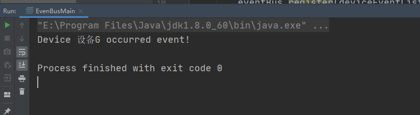
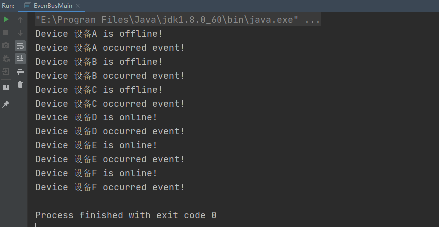
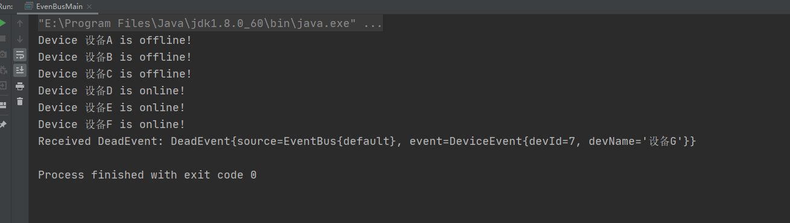
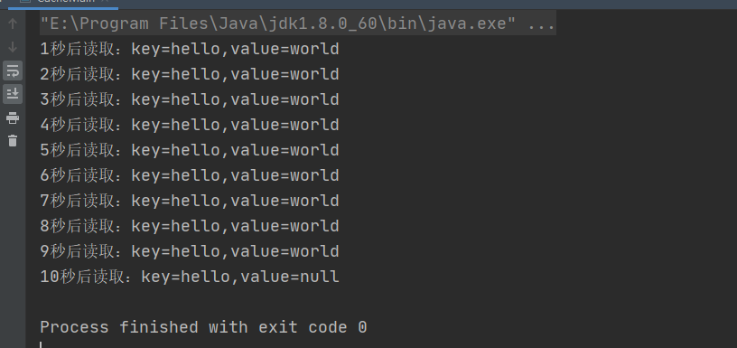
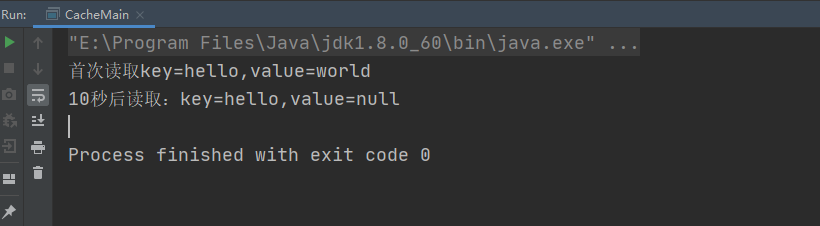
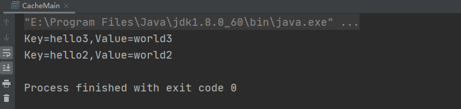
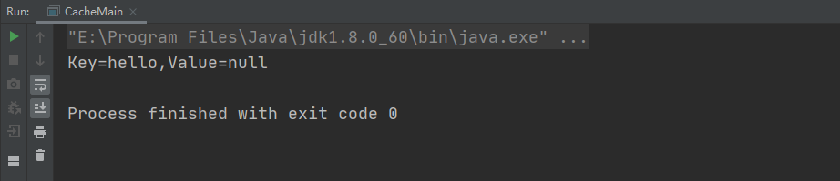

# Guava的使用

[TOC]

## 参考资料

| 资料名称      | 来源                                                         |
| ------------- | ------------------------------------------------------------ |
| Guava官方教程 | https://wizardforcel.gitbooks.io/guava-tutorial/content/1.html |
| Guava官方wiki | https://github.com/google/guava/wiki                         |


## Guava介绍

Guava是Google的一组核心Java类库，其中包括新的集合类型、图形库以及用于并发、I/O、哈希、缓存、字符串等实用工具类，广泛用于Google的大多数项目中，并且被许多公司使用。

Guava工程包含了若干被Google的 Java项目广泛依赖 的核心库，例如：集合 [collections] 、缓存 [caching] 、原生类型支持 [primitives support] 、并发库 [concurrency libraries] 、通用注解 [common annotations] 、字符串处理 [string processing] 、I/O 等等。 


## 功能简介

如下是官网提供的Guava完整功能介绍目录。本文主要探究Guava中提供的集合处理、EventBus消息总线、Guava Cache单机缓存、异步回调工具listenableFutrue以及重试机制，并思考在实际工作中该如何使用以提高开发效率。

### 基本工具 [Basic utilities]

让使用Java语言变得更舒适

- [使用和避免null](http://ifeve.com/using-and-avoiding-null/)：null是模棱两可的，会引起令人困惑的错误，有些时候它让人很不舒服。很多Guava工具类用快速失败拒绝null值，而不是盲目地接受

- [前置条件](http://ifeve.com/google-guava-preconditions/): 让方法中的条件检查更简单

- [常见Object方法](http://ifeve.com/google-guava-commonobjectutilities/): 简化Object方法实现，如hashCode()和toString()

- [排序: Guava强大的”流畅风格比较器”](http://ifeve.com/google-guava-ordering/)

- [Throwables](http://ifeve.com/google-guava-throwables/)：简化了异常和错误的传播与检查

### 集合[Collections]

Guava对JDK集合的扩展，这是Guava最成熟和为人所知的部分

- [不可变集合](http://ifeve.com/google-guava-immutablecollections/): 用不变的集合进行防御性编程和性能提升。

- [新集合类型](http://ifeve.com/google-guava-newcollectiontypes/): multisets, multimaps, tables, bidirectional maps等

- [强大的集合工具类](http://ifeve.com/google-guava-collectionutilities/): 提供java.util.Collections中没有的集合工具

- [扩展工具类](http://ifeve.com/google-guava-collectionhelpersexplained/)：让实现和扩展集合类变得更容易，比如创建`Collection`的装饰器，或实现迭代器

### [缓存](http://ifeve.com/google-guava-cachesexplained)[Caches]

Guava Cache：本地缓存实现，支持多种缓存过期策略

### [函数式风格](http://ifeve.com/google-guava-functional/)[Functional idioms]

Guava的函数式支持可以显著简化代码，但请谨慎使用它

### 并发[Concurrency]

强大而简单的抽象，让编写正确的并发代码更简单

- [ListenableFuture](http://ifeve.com/google-guava-listenablefuture/)：完成后触发回调的Future

- [Service框架](http://ifeve.com/google-guava-serviceexplained/)：抽象可开启和关闭的服务，帮助你维护服务的状态逻辑

### [字符串处理](http://ifeve.com/google-guava-strings/)[Strings]

非常有用的字符串工具，包括分割、连接、填充等操作

### [原生类型](http://ifeve.com/google-guava-primitives/)[Primitives]

扩展 JDK 未提供的原生类型（如int、char）操作， 包括某些类型的无符号形式

### [区间](http://ifeve.com/google-guava-ranges/)[Ranges]

可比较类型的区间API，包括连续和离散类型

### [I/O](http://ifeve.com/google-guava-io/)

简化I/O尤其是I/O流和文件的操作，针对Java5和6版本

### [散列](http://ifeve.com/google-guava-hashing/)[Hash]

提供比`Object.hashCode()`更复杂的散列实现，并提供布鲁姆过滤器的实现

### [事件总线](http://ifeve.com/google-guava-eventbus/)[EventBus]

发布-订阅模式的组件通信，但组件不需要显式地注册到其他组件中

### [数学运算](http://ifeve.com/google-guava-math/)[Math]

优化的、充分测试的数学工具类

### [反射](http://ifeve.com/guava-reflection/)[Reflection]

Guava 的 Java 反射机制工具类


## 导入Guava依赖

```
<dependency>
  <groupId>com.google.guava</groupId>
  <artifactId>guava</artifactId>
  <version>29.0-jre</version>
</dependency>
```


## 集合

### 创建集合

Guava中的Lists类提供了创建List的方法：

```java
public static List<Employee> createEmployeeListOnGuava() {
    return Lists.newArrayList(
        new Employee(1, 20, "John"),
        new Employee(2, 20, "Mike"),
        new Employee(3, 10, "Dog"),
        new Employee(4, 88, "Pig")
    );
}
```

在Java中，对list的初始化一般如下操作：

```java
public static List<Employee> createEmployeeListOnJdk8() {
    List<Employee> employeeList = new ArrayList<>();
    employeeList.add(new Employee(1, 20, "John"));
    employeeList.add(new Employee(2, 20, "Mike"));
    employeeList.add(new Employee(3, 10, "Dog"));
    employeeList.add(new Employee(4, 88, "Pig"));
    return employeeList;
}
```

或：

```java
public static List<Employee> createEmployeeListOnJdk8() {
    return Stream.of(
            new Employee(1, 20, "John"),
            new Employee(2, 20, "Mike"),
            new Employee(3, 10, "Dog"),
            new Employee(4, 88, "Pig")
    ).collect(Collectors.toList());
}
```

或：

```java
public static List<Employee> createEmployeeListOnJdk83() {
    return new ArrayList<Employee>() {
        {
            add(new Employee(1, 20, "John"));
            add(new Employee(2, 20, "Mike"));
            add(new Employee(3, 10, "Dog"));
            add(new Employee(4, 88, "Pig"));
        }
    };
}
```


### Multimap

Guava提供的Multimap集合类可以实现一个键对应多个value，从而让我们处理类似Map<K, Collection\<T>>这种结构的变得比较容易和清晰。

示例：对员工按照年龄进行分组：

使用Multimap：

```java
public static Multimap<Integer, Employee> groupEmployeesOnGuava(List<Employee> employees) {
    Multimap<Integer, Employee> groups = ArrayListMultimap.create();
    employees.forEach(e -> groups.put(e.getAge(), e));
    return groups;
}
```

使用HashMap，在Java8中如下处理：

```java
public static Map<Integer, List<Employee>> groupEmployeesOnJdk81(List<Employee> employees) {
    Map<Integer, List<Employee>> groups = new HashMap<>();
    employees.forEach(e -> groups.computeIfAbsent(e.getAge(), k -> new ArrayList<>()).add(e));
    return groups;
}

public static Map<Integer, List<Employee>> groupEmployeesJdk82(List<Employee> employees) {
    return employees.stream().collect(Collectors.groupingBy(Employee::getAge));
}
```


## EventBus事件总线

EventBus提供了进程内类似发布订阅模式的功能，方便各模块间功能解耦。

EventBus系统使用以下术语描述事件分发：

| 事件     | 可以向事件总线发布的对象                                     |
| -------- | ------------------------------------------------------------ |
| 订阅     | 向事件总线注册*监听者*以接受事件的行为                       |
| 监听者   | 提供一个*处理方法*，希望接受和处理事件的对象                 |
| 处理方法 | 监听者提供的公共方法，事件总线使用该方法向监听者发送事件；该方法应该用Subscribe注解 |
| 发布消息 | 通过事件总线向所有匹配的监听者提供事件                       |

### 基本使用方法

创建设备事件类：

```java
public class DeviceEvent {

    private Integer devId;

    private String devName;

    ...
}
```

创建设备事件监听者类和处理方法：

```java
public class DeviceEventListener {

    // 使用@Subscribe注解标明监听者处理事件使用的方法，传参类型是DeviceEvent
    @Subscribe
    public void processDeviceEvent(DeviceEvent event) {
        System.out.println("Device " + event.getDevName() + " occurred event!");
    }
}
```

订阅和发布消息：

```java
public class EvenBusMain {

    public static void main(String[] args) {
        EventBus eventBus = new EventBus();
        DeviceEventListener deviceEventListener = new DeviceEventListener();
        eventBus.register(deviceEventListener);
        eventBus.post(new DeviceEvent(7, "设备G"));
    }
}
```

输出如下：



### 父类和子类事件类型

如果我们创建DeviceEvent的子类事件类型，并监听，是否会触发父类的监听器？

创建DeviceEvent的子类：

```java
// 设备离线事件
public class DeviceOfflineEvent extends DeviceEvent {
    public DeviceOfflineEvent(Integer devId, String devName) {
        super(devId, devName);
    }
}
// 设备上线事件
public class DeviceOnlineEvent extends DeviceEvent {
    public DeviceOnlineEvent(Integer devId, String devName) {
        super(devId, devName);
    }
}
```

创建对应监听器：

```java
// 设备离线事件监听器
public class DeviceOfflineListener {

    @Subscribe
    public void processDeviceOfflineEvent(DeviceOfflineEvent event) {
        System.out.println("Device " + event.getDevName() + " is offline!");
    }
}
// 设备上线事件监听器
public class DeviceOnlineListener {

    @Subscribe
    public void processDeviceOnlineEvent(DeviceOnlineEvent event) {
        System.out.println("Device " + event.getDevName() + " is online!");
    }
}
```

订阅和发布设备离线和上线事件：

```java
public class EvenBusMain {

    public static void main(String[] args) {
        EventBus eventBus = new EventBus();
        DeviceOfflineListener deviceOfflineListener = new DeviceOfflineListener();
        DeviceOnlineListener deviceOnlineListener = new DeviceOnlineListener();
        DeviceEventListener deviceEventListener = new DeviceEventListener();
        eventBus.register(deviceOfflineListener);
        eventBus.register(deviceOnlineListener);
        eventBus.register(deviceEventListener);

        eventBus.post(new DeviceOfflineEvent(1, "设备A"));
        eventBus.post(new DeviceOfflineEvent(2, "设备B"));
        eventBus.post(new DeviceOfflineEvent(3, "设备C"));
        eventBus.post(new DeviceOnlineEvent(4, "设备D"));
        eventBus.post(new DeviceOnlineEvent(5, "设备E"));
        eventBus.post(new DeviceOnlineEvent(6, "设备F"));
    }
}
```

运行输出如下，可见子类事件发布后，父类事件的监听器也会进行处理：



### DeadEvent

EventBus中没有被监听器处理的事件会被转换为DeadEvent，EventBus中的源码如下：

```java
/**
 * Posts an event to all registered subscribers. This method will return successfully after the
 * event has been posted to all subscribers, and regardless of any exceptions thrown by
 * subscribers.
 *
 * <p>If no subscribers have been subscribed for {@code event}'s class, and {@code event} is not
 * already a {@link DeadEvent}, it will be wrapped in a DeadEvent and reposted.
 *
 * @param event event to post.
 */
public void post(Object event) {
  // 根据event查找消费者集合
  Iterator<Subscriber> eventSubscribers = subscribers.getSubscribers(event);
  if (eventSubscribers.hasNext()) {
    // 分发事件给消费者处理
    dispatcher.dispatch(event, eventSubscribers);
  } else if (!(event instanceof DeadEvent)) {
    // 如果没有消费者，并且event类型不是DeadEvent，将其转换为DeadEvent对象，重新post
    post(new DeadEvent(this, event));
  }
}
```


所以如果要处理DeadEvent事件，我们需要新建DeadEvent事件的监听器，否则就会不进行任何处理。

```java
public class DeadEventListener {

    @Subscribe
    public void processDeadEvent(DeadEvent event) {
        System.out.println("Received DeadEvent: " + event.toString());
    }
}
```


```java
public class EvenBusMain {

    public static void main(String[] args) {
        EventBus eventBus = new EventBus();
        DeviceOfflineListener deviceOfflineListener = new DeviceOfflineListener();
        DeviceOnlineListener deviceOnlineListener = new DeviceOnlineListener();
        //DeviceEventListener deviceEventListener = new DeviceEventListener();
        DeadEventListener deadEventListener = new DeadEventListener();
        eventBus.register(deviceOfflineListener);
        eventBus.register(deviceOnlineListener);
        eventBus.register(deadEventListener);
        // 取消订阅设备事件
        //eventBus.register(deviceEventListener);

        eventBus.post(new DeviceOfflineEvent(1, "设备A"));
        eventBus.post(new DeviceOfflineEvent(2, "设备B"));
        eventBus.post(new DeviceOfflineEvent(3, "设备C"));
        eventBus.post(new DeviceOnlineEvent(4, "设备D"));
        eventBus.post(new DeviceOnlineEvent(5, "设备E"));
        eventBus.post(new DeviceOnlineEvent(6, "设备F"));
        // 发布设备事件
        eventBus.post(new DeviceEvent(7, "设备G"));
    }
}
```

运行输出如下：




## Guava Cache

Guava Cache与ConcurrentMap很相似，但也不完全一样。最基本的区别是ConcurrentMap会一直保存所有添加的元素，直到显式地移除。相对地，Guava Cache为了限制内存占用，通常都设定为自动回收元素。在某些场景下，尽管LoadingCache 不回收元素，它也是很有用的，因为它会自动加载缓存。

Guava Cache是在内存中缓存数据，相比较于数据库或redis存储，访问内存中的数据会更加高效。Guava官网介绍，下面的这几种情况可以考虑使用Guava Cache：

- 愿意消耗一些内存空间来提升速度。
- 预料到某些键会被多次查询。
- 缓存中存放的数据总量不会超出内存容量。

### 构建缓存对象

Cache实例由CacheBuilder类使用建造者设计模式进行创建。

```java
public class CacheMain {
    public static void main(String[] args) {
        // 创建Cache实例
        Cache<String, String> cache = CacheBuilder.newBuilder().build();
        cache.put("hello", "world");
    }
}
```


### 设置过期时间

#### 写入后一定时间过期

下面创建Cache实例并测试其写入后定时过期的机制

```java
public class CacheMain {

    public static void main(String[] args) {
        // 创建Cache实例
        Cache<String, String> cache = CacheBuilder.newBuilder()
                // 写入后10秒过期
                .expireAfterWrite(10, TimeUnit.SECONDS)
                .build();
        cache.put("hello", "world");
        // 测试过期时间
        int count = 0;
        while (count < 10) {
            try {
                count++;
                Thread.sleep(1000);
                System.out.println(count + "秒后读取：key=hello,value=" + cache.getIfPresent("hello"));
            } catch (InterruptedException e) {
                e.printStackTrace();
            }
        }
    }
}
```

输出如下：



#### 访问后一定时间过期

测试Key访问后定时过期的机制：

```java
public static void main(String[] args) {
    Cache<String, String> cache = CacheBuilder.newBuilder()
        // 最大容量
        .maximumSize(10000)
        // 写入后10秒过期
        .expireAfterAccess(10, TimeUnit.SECONDS)
        .build();
    cache.put("hello", "world");
    System.out.println("首次读取key=hello,value=" + cache.getIfPresent("hello"));
    try {
        Thread.sleep(10000);
    } catch (InterruptedException e) {
        e.printStackTrace();
    }
    System.out.println("10秒后读取：key=hello,value=" + cache.getIfPresent("hello"));
}
```

输出如下：



### 设置最大容量

测试最大容量设置：

```java
public class CacheMain {

    public static void main(String[] args) {
        Cache<String, String> cache = CacheBuilder.newBuilder()
                // 最大容量
                .maximumSize(2)
                .build();
        cache.put("hello1", "world1");
        cache.put("hello2", "world2");
        cache.put("hello3", "world3");
        cache.asMap().forEach((k, v) -> System.out.println("Key=" + k + ",Value=" + v));
    }
}
```

输出如下：



可见在超出最大容量时，会去除最早添加的key。

### 设置弱引用

可以通过weakKeys和weakValues方法指定Cache只保存对缓存记录key和value的弱引用。这样当没有其他强引用指向key和value时，key和value对象就会被垃圾回收器回收。

```java
public class CacheMain {

    public static void main(String[] args) {
        Cache<String, Object> cache = CacheBuilder.newBuilder()
                // 最大容量
                .maximumSize(2)
                // value设置为弱引用
                .weakValues()
                .build();
        Object value = new Object();
        cache.put("hello", value);
        value = new Object();
        System.gc();
        System.out.println("Key=hello" + ",Value=" + cache.getIfPresent("hello"));
    }
}
```

输出：



### 显式清除缓存

Cache接口提供了invalidateAll或invalidate方法显式删除Cache中的记录。invalidate方法接收一个参数Key，invalidateAll方法无参数时清除所有记录，传入Iterable类型参数时删除参数中包含的所有Key对应的记录。

### 设置移除监听器

可以设置Cache记录被移除时触发的移除监听器，在记录被删除时执行一些操作。

```java
RemovalListener<String, Object> listener = new RemovalListener<String, Object>() {
    @Override
    public void onRemoval(RemovalNotification<String, Object> notification) {
        System.out.println("Key=" + notification.getValue() + ",Value=" + notification.getValue()
                + " is removed! cause is " + notification.getCause().name());
    }
};

Cache<String, Object> cache = CacheBuilder.newBuilder()
                .maximumSize(5)
                .expireAfterWrite(5, TimeUnit.SECONDS)
                .weakValues()
                // 设置移除监听器
                .removalListener(listener)
                .build();
```

移除原因枚举类如下：

```java
public enum RemovalCause {
  /**
   * 由用户调用invalidate或invalidateAll方法移除
   */
  EXPLICIT {
    @Override
    boolean wasEvicted() {
      return false;
    }
  },

  /**
   * 被覆盖
   */
  REPLACED {
    @Override
    boolean wasEvicted() {
      return false;
    }
  },

  /**
   * 被垃圾回收
   */
  COLLECTED {
    @Override
    boolean wasEvicted() {
      return true;
    }
  },

  /**
   * 记录过期删除
   */
  EXPIRED {
    @Override
    boolean wasEvicted() {
      return true;
    }
  },

  /**
   * 超出最大容量被删除
   */
  SIZE {
    @Override
    boolean wasEvicted() {
      return true;
    }
  };

  /**
   * Returns {@code true} if there was an automatic removal due to eviction (the cause is neither
   * {@link #EXPLICIT} nor {@link #REPLACED}).
   */
  abstract boolean wasEvicted();
}
```


## 并发listenableFutrue回调


## 重试机制
